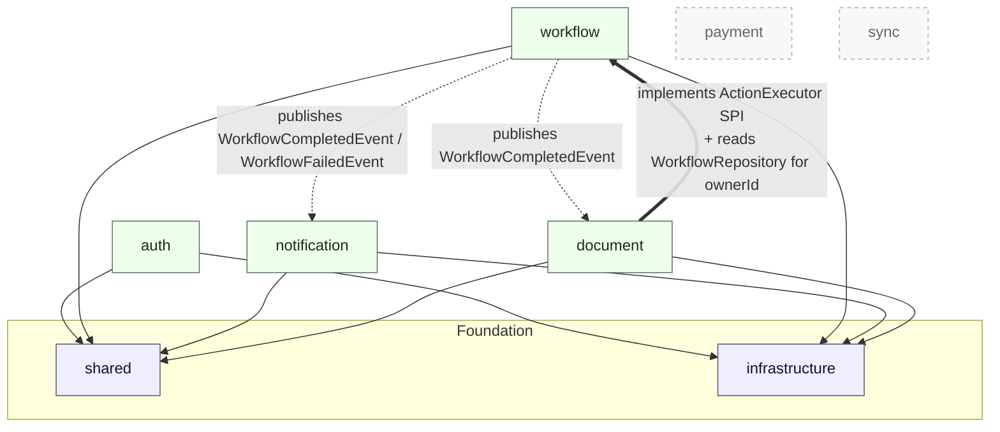
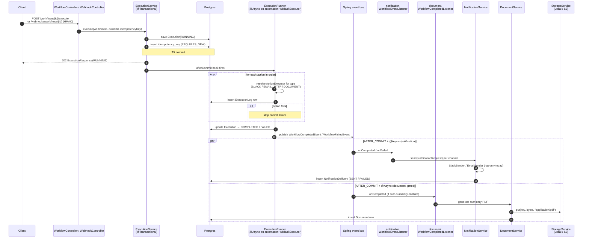

# Architecture

AutomationHub is a modular monolith. One Spring Boot deployable, split internally by business module. Modules communicate **only via Spring `ApplicationEvent`s** — never by injecting another module's service — with one narrow exception called out below.

## Module graph

**Reading the diagram:**

- **Solid arrow** → compile-time dependency (`module A → module B` means A imports types from B).
- **Dotted arrow** → runtime event flow (publisher to consumer), wired via `ApplicationEventPublisher` + `@TransactionalEventListener(AFTER_COMMIT)`.
- **Bold solid arrow** → the one strategic-pattern dependency: `document` implements the `ActionExecutor` SPI defined in `workflow`, and reads `WorkflowRepository` to resolve `ownerId` from an `Action.workflowId`. This is the only cross-module compile dep between feature modules; documented in [`.claude/modules/document.md`](../../.claude/modules/document.md).
- **Dashed boxes** are not yet implemented — do not scaffold preemptively.

## Runtime event flow

What happens when a workflow execution fires, including both webhook and JWT entry paths, the async runner, and the two AFTER_COMMIT consumers.

**Key properties to preserve:**

- `ExecutionService.execute` returns `202` before any action runs — the runner is `@Async` on `automationHubTaskExecutor` and only fires `afterCommit`, so the `Execution(RUNNING)` row is visible to anyone polling.
- Events are published from inside the runner's finalize TX, so `AFTER_COMMIT` consumers only see durable terminal states.
- The two consumers (`notification`, `document`) are isolated: a sender failure or PDF render failure never propagates back into the workflow execution.
- The idempotency insert uses `REQUIRES_NEW` so a unique-constraint race rolls back only that nested TX, not the caller's. See [`.claude/modules/workflow.md`](../../.claude/modules/workflow.md#idempotency-idempotency) for the full rationale.
